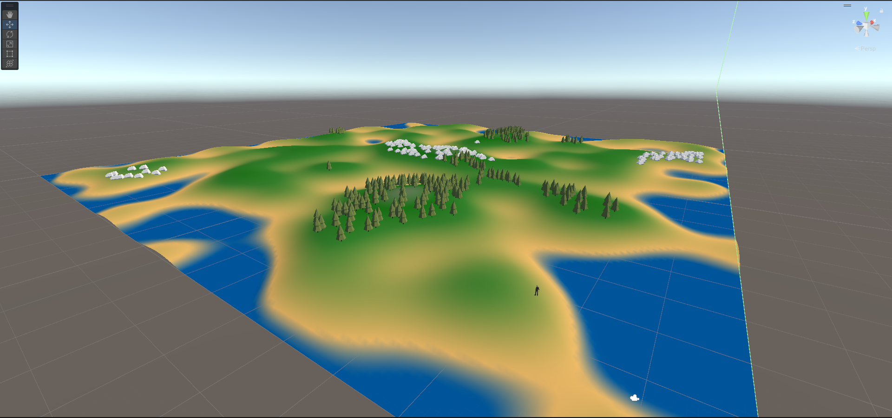
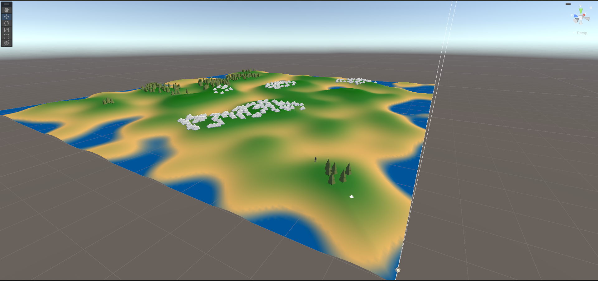

# Isle Of Shadows
A simple, incomplete, 3D survival game in Unity in which a player explores a procedurally generated island.

## Features
- **Procedural Island Generation**  
  Every playthrough creates a unique island using noise-based terrain generation.
- **Resource Collection**  
  Collect wood, stone, and other materials to craft weapons.
- **Day-Night Cycle**  
  - Dynamic lighting changes based on the time of day.
  - Spawns enemies at night.

